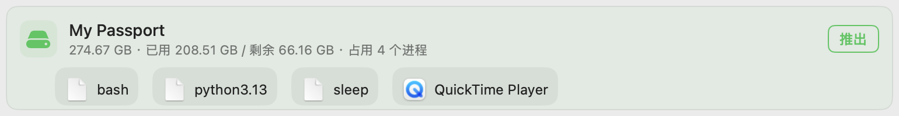

# DiskEjector

**推出硬盘之前，先看清是谁占着它。**



macOS 14+ · SwiftUI · 菜单栏常驻 + 独立窗口 · 应用中文名「磁盘推出助手」 · 简体中文 / 繁體中文 / English

[](https://github.com/wenber-yu/DiskEjector/actions/workflows/ci.yml)

---

## 这一幕你大概不陌生

东西收好了，弯腰去拔移动硬盘。系统弹出一句话，把你拦下：

> 磁盘「My Passport」未能推出，因为一个或多个程序正在使用它。

它承认「有程序在用」，**却没说是什么程序**。

于是只能开始猜。是刚才那个播放器忘了关？把访达窗口挨个关掉再试，还是不行。是备份软件？它明明显示「已完成」。是不是 Spotlight 在后台索引？不知道，也无处可查。再点一次推出 —— 依然是「正在使用中」。

硬盘就这么卡在那儿，谁也动不了。赶时间的时候，很多人干脆把线一拔；而这一拔，正在写入的数据可能就废了。

**DiskEjector 就是为了结束这场猜谜。** 它把占用者直接摆出来：图标加名字，是谁占着，一眼看到。想推出，就从这里推。

## 它做的事

| 能力 | 说明 |
|------|------|
| 说清楚是谁在占用 | 插入硬盘即自动检测，列出每个正在读写它的程序（图标 + 名称）。判断依据是进程是否**持有该磁盘的文件句柄** —— 这正是系统用来决定「能不能推出」的唯一标准，所以列出来的就是真正挡路的那个 |
| 一键推出 | 无人占用时，点一下干净推出 |
| 关闭并推出 | 被占用时不必自己翻进程：一次点掉全部占用者 —— 先请它正常退出，等一小会儿仍在就强制结束，然后重试推出。**这一步会丢失未保存的数据，所以按钮标红、且需你确认** |
| 绝不强卸 | 不使用强制卸载。那不是解决问题，而是把「磁盘忙」换成「数据损坏」 |
| 容量一览 | 每块盘显示 总容量 / 已用 / 剩余，避免拿错盘 |
| 双形态 | 菜单栏常驻面板 + 独立窗口，二者共用同一套推出流程 |
| 失败留痕 | 推出失败会记下时间、磁盘、原因，便于回溯 |
| 多语言 | 简体中文 / 繁體中文 / English |
| 外观 | 透明（Liquid Glass）与色调两种模式，跟随系统深色 / 浅色 |
| 开机自启 | 可设为登录时自动启动 |

## 安装

### 方式一：dmg（推荐）

1. 到 [Releases](../../releases) 下载 `DiskEjector.dmg`
2. 双击挂载，把 `DiskEjector` 拖进 `Applications` 文件夹（dmg 里已备好 Applications 替身）
3. 首次打开：**右键点图标 → 打开**（当前构建未经 Apple 公证，见下方说明）
4. 按引导授权「完全磁盘访问」（下一节就是它）

### 方式二：zip

下载 `DiskEjector.zip`，解压得到 `DiskEjector.app`，拖进 `Applications`，同样需要第 3、4 步。

> **为什么首次打开要绕一下？**
> 本版本使用开发期自签证书，**未经过 Apple 公证（notarization）**，Gatekeeper 会默认拦截。
> 若「右键 → 打开」无效，可移除隔离属性后再打开：
> ```bash
> xattr -dr com.apple.quarantine /Applications/DiskEjector.app
> ```

## 需要「完全磁盘访问」授权

**这是核心功能的前置条件，不授权就看不到占用进程。** 启动后主窗口顶部会出现引导横幅，点「打开系统设置」直达：

> 系统设置 › 隐私与安全性 › 完全磁盘访问 › 勾选 DiskEjector

**为什么非它不可。** 要读出**其他**进程打开了哪些文件，应用必须以「完全磁盘访问」运行；否则系统会让它对其他进程的文件一律不可见。而这恰恰是最容易漏掉的一类占用者 —— 比如 Spotlight 的索引进程正抓着你的盘，它属于系统，普通权限根本看不到。未授权时，应用不会假装「没有占用」，而是明确显示「需要完全磁盘访问」。

## 许可证

[MIT](LICENSE) —— 可自由使用、修改与分发。
